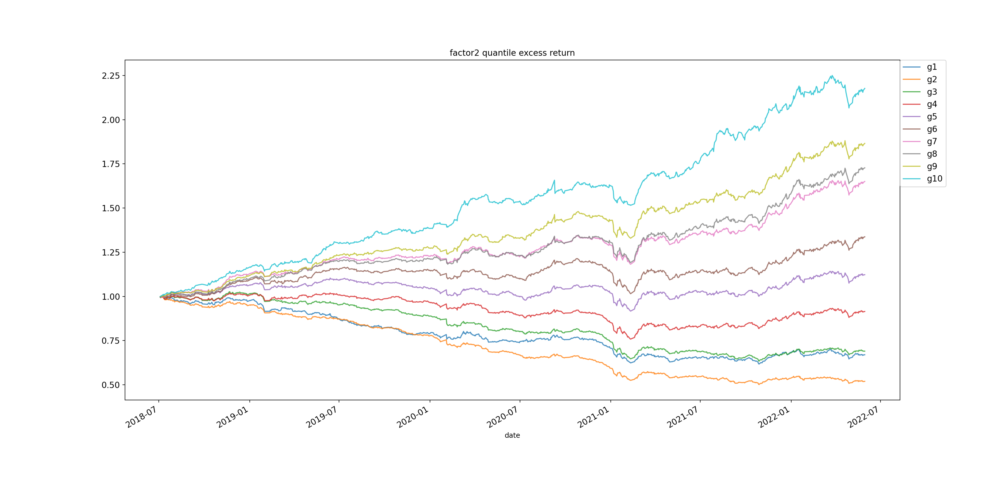

# 使用Factor生成因子

## 1. 运行程序

将`factor.feather`放在目录`./data/`下，之后运行如下指令来生成每日的数据点。所有的数据点会放在`./data/daypoint/`目录下，因此需要先创建该目录：

```bash
python generate_daypoint.py
```

之后根据生成的数据训练模型。模型结果会放在目录`./data/result/`目录下。训练模型的程序参数如下：

1. `--end`：指定训练数据的结束日期，这里多加了一天，保证6月30也包括进去，实际上不需要。保存模型的名称也会根据这个参数指定；
2. `--device`：指定训练使用的设备，cpu或者gpu

```bash
python main.py --end 2018-06-31 --device cuda
```

训练玩模型之后根据模型预测后半年的结果，程序的参数如下：

1. `--start`：起始时间；
2. `--end`：结束时间
3. `--model`：选择使用哪一个模型，例子中使用了上面训练的2018-06-31的模型
4. `--device`：同上

```bash
python prediction.py --start 2018-07-01 --end 2018-12-32 --model 2018-06-31 --device cuda
```

## 2. 回测结果

使用LSTM进行训练并且进行日频回测，最终结果如下：



具体的半年训练一次的统计量结果如下：


| Date       | IC Mean | IC Std  | Rank IC | IC_IR   | positive_ic |
| ---------- | ------- | ------- | ------- | ------- | ----------- |
| 2018-12-32 | 0.03723 | 0.03849 | 0.03464 | 0.96735 | 0.82258     |
| 2019-06-31 | 0.04096 | 0.04199 | 0.04784 | 0.97530 | 0.84746     |
| 2019-06-31 | 0.04270 | 0.03983 | 0.04446 | 1.07197 | 0.84746     |
| 2019-12-32 | 0.03912 | 0.04538 | 0.02551 | 0.86203 | 0.81746     |
| 2020-06-31 | 0.04571 | 0.06094 | 0.03623 | 0.75000 | 0.80342     |
| 2020-12-32 | 0.03608 | 0.04822 | 0.02986 | 0.74812 | 0.82540     |
| 2021-06-31 | 0.04639 | 0.04248 | 0.03267 | 1.09219 | 0.85593     |
| 2021-12-32 | 0.03144 | 0.04268 | 0.02488 | 0.73657 | 0.76000     |
| 2022-06-31 | 0.04462 | 0.05210 | 0.03578 | 0.85641 | 0.81081     |


